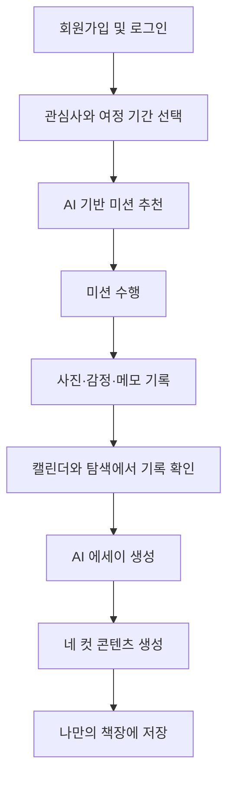
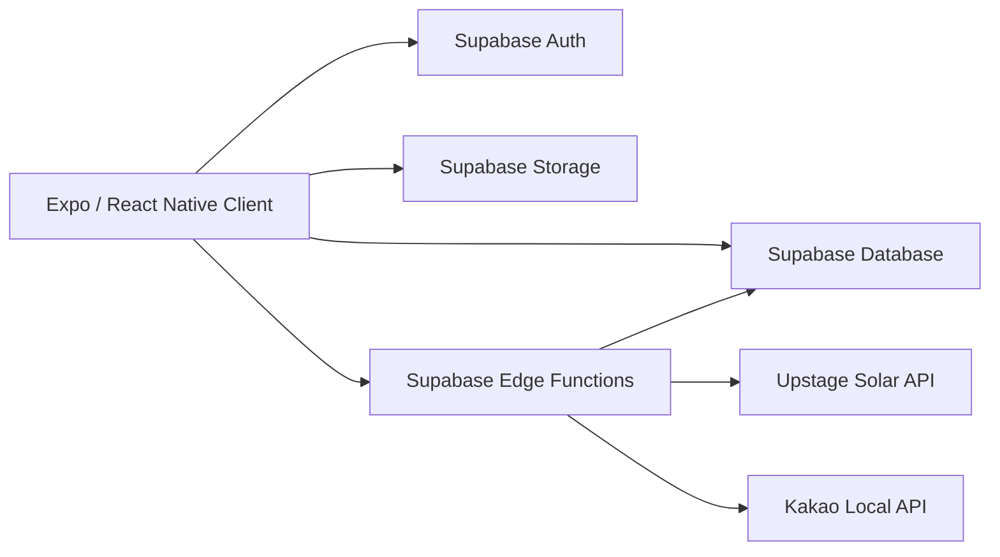

# Begin Again

> **젊음을 젊음으로 낭비한 것을 후회하지 않도록,  
> 일상의 작은 도전과 감정을 기록해 나만의 이야기로 완성하는 여정형 서비스**

- **Web:** https://logmapbeginagain.vercel.app/
- **GitHub:** https://github.com/yeondae-0524/AI-Builder-Sprint
- **AI 활용 문서:** [`AI_USAGE.md`](./AI_USAGE.md)

심사용 테스트 계정이 필요한 경우 제출 구글폼 또는 운영진 메일을 통해 별도로 제공합니다.

---

## 서비스 소개

**Begin Again**은 효율과 성과에 지친 사용자가 잠시 속도를 늦추고, 자신의 일상과 감정에 집중할 수 있도록 돕는 서비스입니다.

사용자는 **1주, 2주 또는 한 달의 여정**을 시작하고, 관심사와 상황에 맞게 추천된 작은 미션을 수행합니다. 미션을 수행하며 사진, 감정, 메모를 기록하면 AI가 쌓인 기록을 하나의 에세이와 네 컷 콘텐츠로 정리합니다.

평소에는 무심코 지나쳤던 경험을 다시 바라보고, 그 안에서 발견한 감정과 변화를 자신의 이야기로 간직할 수 있습니다.

---

## 문제 정의

우리는 더 빠르고 효율적인 삶을 요구받지만, 그 과정에서 자신의 감정과 일상을 충분히 돌아보지 못합니다.

Begin Again은 거창한 목표보다 다음과 같은 작은 경험에 집중합니다.

- 평소 지나치던 계절의 변화 발견하기
- 익숙한 장소를 새로운 방식으로 경험하기
- 좋아하는 냄새, 소리, 풍경 기록하기
- 자신의 감정에 이름 붙이기
- 쌓인 기록을 통해 변화한 자신 돌아보기

---

## 서비스 이용 흐름



---

## 핵심 기능

### 1. 여정 생성

- 1주, 2주 또는 한 달 단위의 여정 생성
- 사용자의 관심사와 활동 성향 반영
- 여정별 미션과 기록 관리

### 2. AI 미션 추천

- Upstage Solar API를 활용한 맞춤형 미션 생성
- 일상에서 바로 수행할 수 있는 일상형 미션
- 사용자 주변 장소를 활용하는 장소형 미션
- 거리, 비용, 소요 시간 등을 고려한 추천

### 3. 미션 수행 및 기록

- 미션 수행 사진 업로드
- 당시의 감정 선택
- 경험에 대한 자유로운 메모 작성
- 기록 공개 범위 설정

### 4. 캘린더 기반 아카이빙

- 날짜별 미션 기록 확인
- 여정 진행 상황 확인
- 과거의 사진과 감정을 시간순으로 회고

### 5. 탐색 및 소셜 기능

- 다른 사용자가 공개한 기록 탐색
- 다양한 미션 경험 확인
- 다른 사용자의 기록을 통해 새로운 활동 발견

### 6. AI 에세이 생성

- 완료된 여정의 기록을 기반으로 에세이 생성
- 사용자가 실제로 남긴 사진, 감정, 메모를 중심으로 구성
- 기록되지 않은 사건이나 감정을 임의로 만들지 않도록 제한
- 각 기록을 연결해 여정 전체를 하나의 이야기로 구성

### 7. 네 컷 콘텐츠 및 책장

- 여정 기록을 활용한 네 컷 콘텐츠 생성
- 완성된 에세이와 시각 콘텐츠 저장
- 나만의 책장에서 과거 여정 다시 보기

---

## AI 활용 및 증빙

Begin Again은 AI를 단순한 부가 기능이 아니라, 사용자의 경험을 발견하고 회고하도록 돕는 핵심 기능으로 활용합니다.

### 사용 모델

- **Upstage Solar API**

### AI 적용 영역

| 기능 | 입력 | 출력 |
|---|---|---|
| 미션 추천 | 관심사, 여정 기간, 비용, 활동 유형, 위치 조건 | 사용자가 실제로 수행할 수 있는 맞춤형 미션 |
| 에세이 생성 | 미션 기록, 감정, 메모, 기록 순서 | 완료된 여정을 연결한 회고형 에세이 |
| 네 컷 구성 | 기록별 핵심 장면과 감정 | 여정 흐름을 요약한 시각 콘텐츠 구성안 |

### 프롬프트 설계 원칙

AI가 사용자의 실제 경험을 벗어나지 않도록 다음 규칙을 적용했습니다.

- 사용자가 기록하지 않은 사건, 장소, 행동을 생성하지 않습니다.
- 사용자가 기록하지 않은 감정을 임의로 단정하지 않습니다.
- 기록의 시간 순서와 `recordIndex`를 유지합니다.
- 기록 수와 AI 응답 항목 수가 일치하도록 요청합니다.
- 에세이는 실제 메모와 감정을 중심으로 연결합니다.
- 네 컷 콘텐츠는 각 기록의 핵심 장면을 바탕으로 구성합니다.

프롬프트 규칙 예시:

```text
사용자가 기록하지 않은 사건, 장소, 감정을 만들지 마세요.
기록의 순서와 recordIndex를 그대로 유지하세요.
각 결과는 반드시 제공된 사용자 기록을 근거로 작성하세요.
```

### 응답 검증

AI 응답을 그대로 저장하지 않고 다음 항목을 검증합니다.

- 필수 필드 존재 여부
- 기록 수와 결과 배열 수의 일치 여부
- `recordIndex` 범위와 순서
- 빈 문자열 또는 잘못된 형식의 응답
- JSON 파싱 가능 여부
- 사용자 기록과 연결되지 않은 결과 여부

검증에 실패한 응답은 저장하지 않고 오류로 처리합니다.

### 구현 증빙 위치

```text
supabase/functions/     # AI 미션 추천 및 에세이 생성 Edge Functions
services/               # 클라이언트와 AI 함수 사이의 요청·응답 처리
backend/                # 통합 테스트 및 AI 응답 검증
AI_USAGE.md             # AI 활용 범위와 검증 과정 상세 문서
```

실제 실행 화면을 추가할 경우 `docs/images/` 폴더에 이미지를 저장하고 아래 형식으로 연결합니다.

```md


```

개발 과정에서 AI를 활용한 범위와 결과 검증 과정은 [`AI_USAGE.md`](./AI_USAGE.md)에서 자세히 확인할 수 있습니다.

---

## 기술 스택

| 구분 | 기술 |
|---|---|
| Frontend | Expo SDK 54, React Native 0.81, React 19, TypeScript |
| Routing | Expo Router |
| Web Deployment | Vercel |
| Backend | Supabase Edge Functions, Node.js |
| Database | Supabase PostgreSQL, RPC |
| Authentication | Supabase Auth |
| Storage | Supabase Storage |
| AI | Upstage Solar API |
| External API | Kakao Local API |
| Quality Check | TypeScript, Expo ESLint |

---

## 시스템 구성



---

## 로컬 실행 방법

### 1. 저장소 클론

```bash
git clone https://github.com/yeondae-0524/AI-Builder-Sprint.git
cd AI-Builder-Sprint
git switch develop
```

### 2. 패키지 설치

```bash
npm install
```

### 3. 환경변수 파일 생성

macOS / Linux:

```bash
cp .env.example .env
```

Windows PowerShell:

```powershell
Copy-Item .env.example .env
```

`.env`에 실제 테스트용 값을 입력합니다.

```env
EXPO_PUBLIC_SUPABASE_URL=https://your-project.supabase.co
EXPO_PUBLIC_SUPABASE_KEY=your_supabase_publishable_or_anon_key
```

### 4. 프로젝트 검증

```bash
npx tsc --noEmit
npm run lint
```

### 5. 앱 실행

웹:

```bash
npm run web
```

Expo 개발 서버:

```bash
npm run start
```

Android:

```bash
npm run android
```

iOS:

```bash
npm run ios
```

캐시 문제가 발생하는 경우:

```bash
npx expo start --clear
```

---

## 환경변수

### 클라이언트 환경변수

| 변수명 | 필수 | 설명 |
|---|---:|---|
| `EXPO_PUBLIC_SUPABASE_URL` | O | Supabase 프로젝트 URL |
| `EXPO_PUBLIC_SUPABASE_KEY` | O | 클라이언트용 Supabase publishable 또는 anon key |

`EXPO_PUBLIC_` 접두사가 붙은 환경변수는 앱 번들에 포함될 수 있습니다. Service Role Key, Secret Key, Upstage API Key 등의 비밀값을 입력하면 안 됩니다.

### 서버 및 배포 환경변수

| 변수명 | 설정 위치 | 설명 |
|---|---|---|
| `UPSTAGE_API_KEY` | Supabase Edge Functions Secret | AI 미션 추천 및 에세이 생성 |
| `SUPABASE_URL` | Supabase / Backend | Supabase 프로젝트 URL |
| `SUPABASE_SECRET_KEY` | Backend Secret | 서버 전용 Supabase 키 |
| `KAKAO_REST_API_KEY` | Backend Secret | Kakao 장소 검색 API |

실제 비밀값과 주최 측 또는 운영진이 제공한 API 키는 GitHub에 커밋하지 않습니다.

---

## 주요 테스트 시나리오

1. 회원가입 또는 심사용 계정으로 로그인합니다.
2. 관심사와 여정 기간을 선택합니다.
3. 추천 미션을 확인하고 여정을 시작합니다.
4. 미션 수행 후 사진, 감정, 메모를 기록합니다.
5. 캘린더에서 저장된 기록을 확인합니다.
6. 탐색 화면에서 다른 사용자의 공개 기록을 확인합니다.
7. 완료된 여정을 바탕으로 AI 에세이를 생성합니다.
8. 생성된 에세이와 네 컷 콘텐츠를 확인합니다.
9. 완성된 결과물을 책장에 저장합니다.

---

## 프로젝트 구조

```text
AI-Builder-Sprint/
├─ app/                    # Expo Router 기반 화면
├─ components/             # 공통 UI 컴포넌트
├─ contexts/               # 전역 상태 및 인증 컨텍스트
├─ lib/                    # Supabase 클라이언트 등 공통 모듈
├─ services/               # 도메인별 API 및 데이터 접근 로직
├─ supabase/
│  ├─ functions/           # AI 및 서버 로직 Edge Functions
│  └─ migrations/          # 데이터베이스 마이그레이션
├─ backend/                # 별도 백엔드 및 통합 테스트 도구
├─ AGENTS.md               # 코딩 에이전트 작업 규칙
├─ AI_USAGE.md             # AI 활용 및 검증 과정
├─ app.json                # Expo 앱 설정
└─ package.json            # 프로젝트 의존성과 실행 명령
```

---

## 제출 전 검증

```bash
npx tsc --noEmit
npm run lint
npm run web
git status
```

- 배포 주소가 정상적으로 열리는지 확인합니다.
- `.env`와 실제 API 키가 커밋되지 않았는지 확인합니다.
- 심사용 테스트 계정 비밀번호를 공개 파일에 작성하지 않습니다.
- `git status`에서 의도하지 않은 파일이 포함되지 않았는지 확인합니다.

---

## 서비스 메시지

> 거창한 변화가 아니어도 괜찮습니다.  
> 오늘의 작은 경험을 기록하는 순간, 당신의 삶은 다시 시작됩니다.
